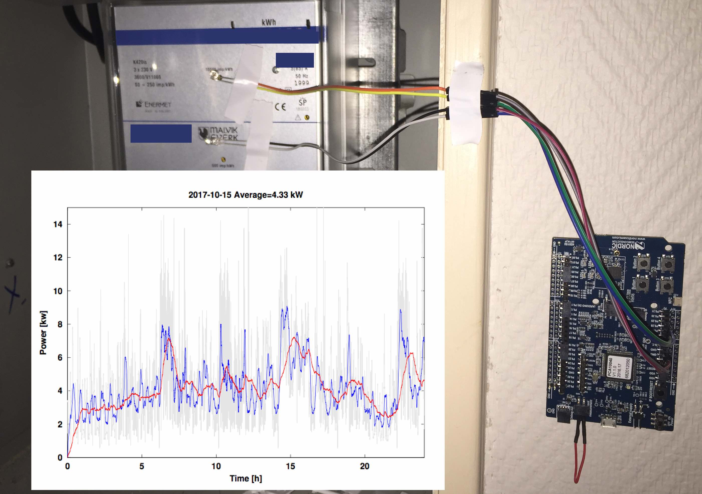
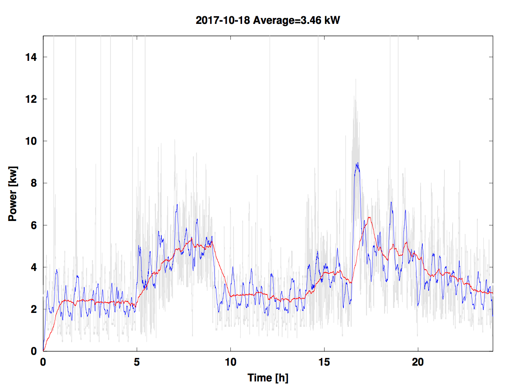

# Utility meter

## General idea
In my house I use way to much power (40 MWh per year), and I
wanted to figure out why. On my power meter I have a blinking light that blinks 10 000 times per
kWh. Thus, enter nRF52 with SAADC and some photo
sensitive diodes. The setup is shown below:


The general idea is to detect the blinking light with an
photo-sensitive diode, and use a second diode for ambient light
cancellation. The pull-up resistors in the SAADC are used to bias the
diodes, which prevents static current since the pull-up's are
disconnected when SAADC is not sampling.

## Equipment
- nRF52832 DK [PCA 10040](http://www.nordicsemi.com/eng/Products/Bluetooth-low-energy/nRF52-DK)
- Photo sensitive diode (I'm using
  [TEPT 5600](https://www.elfadistrelec.no/no/sensor-for-omgivelseslys-570-nm-25-140-ua-vishay-tept-5600/p/17522425?channel=b2b&price_afd=4.69&gclid=CjwKCAjwssvPBRBBEiwASFoVd6O3ZSBKCkvYCGIcLTu5Lv50wTM1IL8qSL6yn2cJLDt1JOD39pFJgxoCI1gQAvD_BwE&gclsrc=aw.ds),
  which is actually a phototransistor, but that's details)

## Algorithm
The best way to understand the algorithm is to read the code, because
it may have changed, but in broad strokes

- Wait for RTC tick
- Sample differential voltage with SAADC
- Check if its a blink
```c
//Remove median value, helps with offset
if(results[0] < min){
    min = results[0];
}
if(results[0] > max){
    max = results[0];
}
results[0] -= (max + min)/2;

//Detected a blink, basically a zero cross detection
last_blink_status = blink_status;
if(results[0] <  0 - adc_hysteresis){
    blink_status = 0;
}else if(results[0] > 0 + adc_hysteresis){
	blink_status = 1;
}
if(last_blink_status ==1 && blink_status == 0){
	blink_counter++;
}
```
- Count blinks over 4 seconds, and calculate the kW
- Transmit an advertizing packet with the kW result embedded in the payload.

## Status
:white_check_mark: Get low power sampling with SAADC working 

:white_check_mark: Add light sensor, and see if I can detect the
blinking from the utility meter 

:white_check_mark: Add low-power beacon based on
https://github.com/NordicSemiconductor/solar_sensor_beacon 

:white_check_mark: Setup a nRF52 to capture the packets
https://github.com/wulffern/nrf52-utilitycapture . At this point my
laptop is reading out from the nRF52 capture memory, and plotting the
kWh over a day, but I need to migrate to a Raspberry Pi or similar

:x:  Try it on a Raspberry Pi to use as a gateway

:x: Add nRFCloud functionallity 

## Results (so far)




## To run
Ideally it should be

    make
    make SERIAL=<debugger serial> flash 
  
But rarely that will suffice, you probably have to at least change 
SDKPATH in the Makefile

The debugger serial can be found with

	nfjprog -f nrf52 --ids


## Excuses
I'm not a professional embedded programmer (i.e I don't get paid to 
program embedded code), so I'm sorry if you find these examples a bit
messy.

Any concrete criticism/improvment requests are welcome. Send me a
private message on devzone.nordicsemi.com

## Thanks to
- Hans E. for help with the Solar Sensor Beacon Packet format
- Håkon A., Jon Gunnar S. and the Nordic support team for answering questions.

## Disclamer
This is not an official Nordic Semiconductor release, it's examples
I've compiled in my "offline" time.


